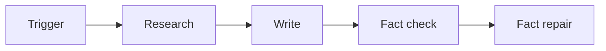
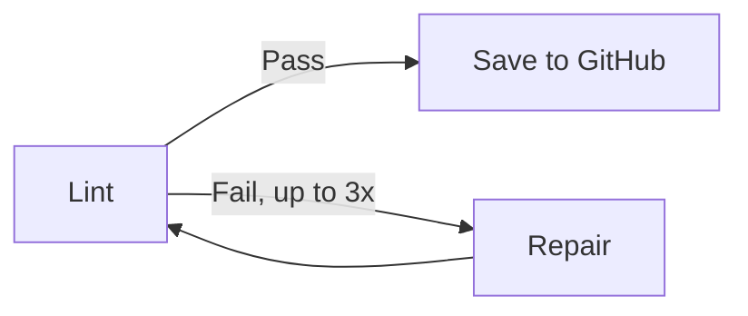

# Vercel case study

The assignment was to build a lightweight agent and use it to produce a comparison piece on Vercel Workflows and Cloudflare Workflows. The timeline was tight.

## Built on Vercel Workflows

I built the pipeline on Vercel Workflows. Three reasons:

- **Reliability.** Multi-step LLM pipelines fail. This needed to just work.
- **First-hand experience.** You write a better comparison after building on one of the platforms.
- **The work documents itself.** Every pipeline run is a versioned draft. Every iteration is logged.

The refine endpoint is a plain API route, not a workflow. A single LLM call that completes in seconds doesn't need durable execution. The choice reflects the argument the article makes.

## The article

[Live article](https://resilient-agents.vercel.app/article)

The piece examines how Vercel and Cloudflare have each built durable execution into their platforms, why the two implementations differ at the architectural level, and what that means for developers building AI agents on top of them.

## What was built

An outline-driven content pipeline deployed on Vercel using Vercel Workflows for durable execution. You POST an outline, the pipeline runs, and a finished markdown draft is committed to the repo.

**Tech stack:** Next.js App Router, Vercel Workflow DevKit, Anthropic SDK, GitHub Contents API

**Pipeline stages:**



Output then passes to the lint loop:



**Agents:**

| Agent | Model | Role |
|---|---|---|
| Researcher | claude-haiku-4-5 | Extracts claims and context from the outline. Flags uncertain facts with [VERIFY]. |
| Writer | claude-sonnet-4-6 | Produces a full markdown draft. Reads STYLE_GUIDE.md before writing. |
| Fact checker | claude-sonnet-4-6 | Checks the draft against the outline. Inserts [FACT-CHECK: ...] annotations for anything that needs correction. |
| Fact repair | claude-sonnet-4-6 | Resolves all [FACT-CHECK: ...] annotations before the linter runs. |
| Repair | claude-sonnet-4-6 | Fixes linter violations. Runs up to three times until the draft is clean. |

**The linter** is fully deterministic — no LLM involved. It checks for prohibited words, sentences over 35 words, passive voice, em dashes, hype openings, Oxford comma violations, and declarations of a winner after code blocks.

**STYLE_GUIDE.md** encodes the voice and formatting rules the writer reads before producing a draft: sentence length, heading style, attribution rules, code block conventions, and a list of banned words.

**The refine endpoint** (`/api/pipeline/refine`) is a plain Next.js API route introduced in iteration 3. It accepts a draft and a list of targeted feedback items, makes a single LLM call, and returns a structured before/after diff for review. The full pipeline produces drafts. The refine endpoint fixes them.

## How the content was produced

The full log is in ITERATIONS.md. The pipeline produced an initial draft from a structured outline. Each iteration identified specific problems and made targeted changes. Early iterations ran the full pipeline. Later ones used the refine endpoint for sentence-level fixes, then direct string replacement when the changes were already precisely defined. The transition was deliberate: use the right tool for the job.

## Where to find things

```
app/api/pipeline/trigger/    — full pipeline trigger endpoint
app/api/pipeline/refine/     — lightweight refine endpoint (single LLM call)
src/workflow/                — Vercel Workflow orchestration
src/agents/                  — researcher, writer, factChecker, factRepair, repair, refine
src/lib/linter.ts            — deterministic linter
STYLE_GUIDE.md               — voice and style rules used by the writer agent
outlines/                    — the outline that drove this piece
drafts/                      — all draft outputs, versioned by run ID and refinement pass
ITERATIONS.md                — full iteration log: problems observed, changes made, reasoning
```

